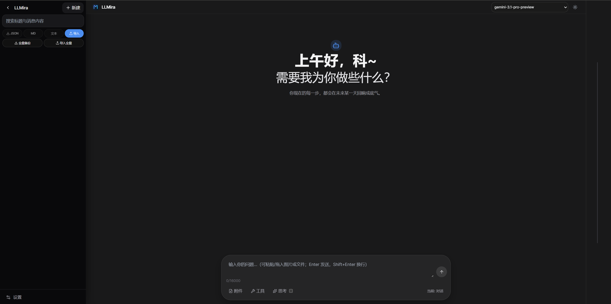
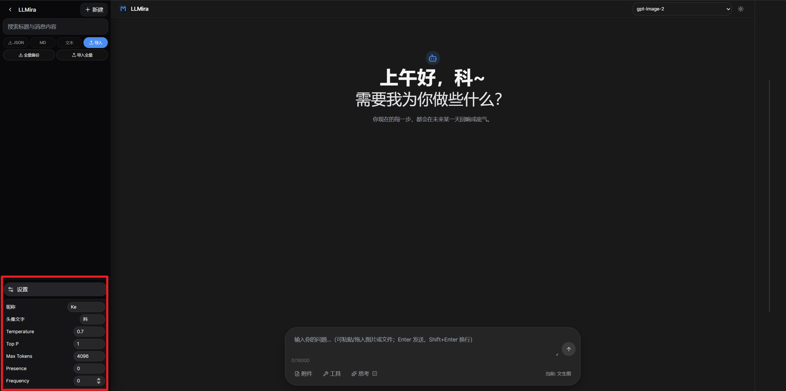

# LLMira

基于 Next.js 14 + TypeScript 的本地优先 AI 对话应用，默认对接慧言 OpenAI 兼容接口。

`LLMira` 可理解为 `LLM + Mira`：

- **LLM**：Large Language Model，表示本项目围绕大模型能力构建。
- **Mira**：命名灵感来自“镜像 / 映照（mirror）”语义，以及古典词源意象。`Mira` 在现代语言中常被理解为“令人惊叹/美丽”（拉丁语词根 *mirus* 的阴性形式），也可借用其“星名（米拉）”的象征意义。

在本项目语境里，`LLMira` 表达的是：一个面向大模型服务的镜像式接入与交互界面。  
注：若严格按语言学来源，“Mira”更常见于拉丁语及现代命名传统，而非古希腊语。


## 文档与规范

- 模块文档索引：[docs/README.md](docs/README.md)
- 架构总览：[docs/engineering/architecture.md](docs/engineering/architecture.md)
- 工程规范（Git、日志、注释）：[docs/engineering/CONTRIBUTING.md](docs/engineering/CONTRIBUTING.md)
- Python 附录（若仓库含 `.py`）：[docs/engineering/python-appendix.md](docs/engineering/python-appendix.md)
- Cursor 工程规则：[.cursor/rules/engineering-standards.mdc](.cursor/rules/engineering-standards.mdc)

## 项目结构（精简）

```text
src/
  app/           # App Router：页面与 error 边界
  components/    # UI：chat、layout、markdown、modals、ui（Radix 封装）
  hooks/         # useChat、useConversations、useModels 等
  lib/           # api、db、store、logger、chat 工具
  types/         # 共享 TS 类型与声明
docs/
  engineering/   # 架构、贡献指南、Python 附录
  features/      # 按模块的功能说明
```

## 功能特性

### 对话与交互

- 左侧历史会话 + 右侧主对话区；**桌面端**可折叠侧栏，**移动端**侧栏为抽屉（顶部菜单打开/遮罩关闭）
- 深色 / 浅色主题切换
- API Key 配置弹窗（未配置时自动提示）
- **流式对话**（SSE），支持 **停止生成**（Abort）
- 切换会话时自动中止当前流，避免串会话
- **深度思考**：可选开启；思考内容与正式回答分区展示（可折叠、灰色区分）
- 消息级操作：复制、编辑用户消息并重新回答、删除、最后一条助手 **重新生成**（对话 / 文生图按场景走对应请求）
- 顶部 **文生图 / 对话** 模式切换；文生图走 `images/generations` 接口

### 输入与附件

- 支持 **拖入**、**选择文件**、在输入框内 **粘贴** 图片或文件
- 多模态：图片随对话以 `image_url` 提交；非图片在发送文案中附带文件名提示
- 可选环境变量 **输入长度上限**：`NEXT_PUBLIC_INPUT_MAX_CHARS`（默认 16000）
- Enter 发送 / Shift+Enter 换行；发送结束后输入框自动聚焦

### 内容与数据

- Markdown + LaTeX (KaTeX) + 代码高亮（纵向限高、长代码可折叠）+ 一键复制
- 文生图结果：网格展示，支持 **放大预览**、下载、复制链接、加载失败重试
- Dexie.js **本地会话持久化**；侧栏支持按 **标题与消息正文** 搜索
- 侧栏 **重命名** 会话，支持导出 **JSON / Markdown / 纯文本**，以及 **导入 JSON**
- 宽屏下右侧 **提问导览**（轨道悬停展开；点击定位到对应用户消息）与 **Artifacts** 面板可切换（代码或 HTML 片段预览）
- **结构化日志**：统一 `@/lib/logger`，分级与 JSON 行输出（生产）；业务打点含 `[Request Model]`、`[Stream Start]`、`[Token Count]`（见「日志链路」）

### 其他

- 模型列表通过 `GET /v1/models` 拉取；可用 `NEXT_PUBLIC_MODEL_PRESET` 补充固定模型 id
- 响应式布局：视口与安全区（含底部输入区）适配移动浏览器

## API 文档参考

- [慧言 API 教程](https://doc.zhypub.cn/docs/api/)
- [OpenAI 协议示例](https://s.apifox.cn/684f53a9-f231-43b0-a0dc-e3224d5ab341/api-179544799)

## 本地开发

1. 安装依赖

```bash
npm install
```

1. 配置环境变量

```bash
cp .env.example .env.local
```

`.env.local` 示例：

```env
NEXT_PUBLIC_API_BASE_URL=https://api.huiyan-ai.cn
# 可选：模型下拉偏少或拉取失败时，用英文/中文逗号列出常用 id，与接口结果合并
# 注：此处的url `https://api.huiyan-ai.cn` 可以替换为其他api厂家
# NEXT_PUBLIC_MODEL_PRESET=gpt-5-chat,deepseek-chat
# 可选：输入框最大字符数（默认 16000）
# NEXT_PUBLIC_INPUT_MAX_CHARS=16000
```

1. 启动开发服务

```bash
npm run dev
```

访问 `http://localhost:3000`（会重定向到 `/chat`）。

1. 构建与检查

```bash
npm run build
npm run lint
```

## 日志链路

应用代码请使用 `@/lib/logger`（分级：`debug` / `info` / `warn` / `error`）。可通过环境变量 `NEXT_PUBLIC_LOG_LEVEL` 或 `LOG_LEVEL` 控制最低级别（默认 `info`）。

开发模式下常见业务打点包括：

- `[Request Model]`
- `[Stream Start]`
- `[Token Count]`

## Docker 部署

```bash
docker build -t llmira .
docker run --rm -p 3000:3000 --env NEXT_PUBLIC_API_BASE_URL=https://api.huiyan-ai.cn llmira
```

## 页面展示

### 页面整体（暗色主题）


### 页面整体（亮色主题）
.png)

### 切换文生图模式


### 设置模型参数


### 切换模型
