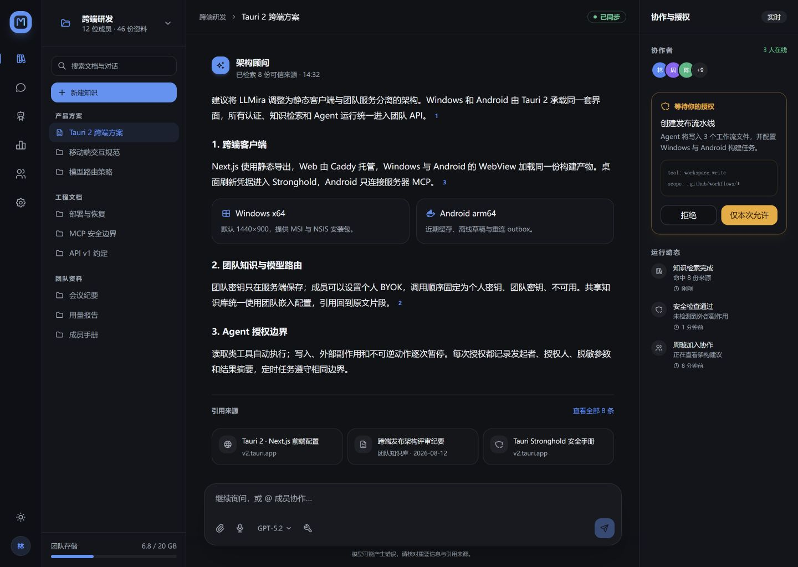
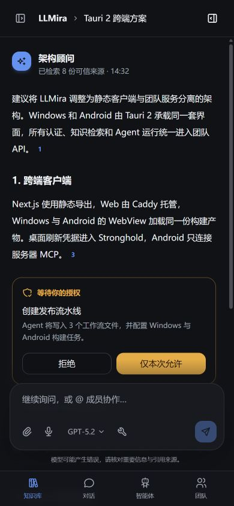

<!--
  Purpose: LLMira 产品入口、下载方式与快速使用指南
  Author: fangtoast <fangtoast@foxmail.com>
  Copyright: LLMira contributors
-->

<div align="center">
  
  <h1>LLMira</h1>
  <strong>面向每个人的全能 AI 工作台</strong>
  <p>多模型对话 · 个人知识库 · 可控 Agent · 可选团队协作 · Web / Windows / Android</p>
  <p>
    <a href="#下载开发版">下载</a> ·
    <a href="#个人核心功能">功能</a> ·
    <a href="#个人使用指南">使用说明</a> ·
    <a href="docs/README.md">文档</a> ·
    <a href="#english-version">English</a>
  </p>
</div>

> [!IMPORTANT]
> LLMira 当前处于 **Developer Preview（开发预览版）**。个人用户可以独立使用完整工作台；团队协作是按需启用的额外能力。当前客户端仍需连接自托管 LLMira 服务，尚不是纯本地、完全离线应用。

## 下载开发版

前往 **[GitHub Releases](https://github.com/fangtoast/LLMira/releases)** 下载，不需要从源码自行打包。版本标签 `v*` 推送后，GitHub 会在同一个 Release 中自动附上 Windows 与 Android 安装包及 SHA-256 校验文件。

| 平台 | 下载文件 | 安装方式 |
| --- | --- | --- |
| Windows 10/11 x64 | `LLMira_*_x64-setup.exe`（推荐）或 `.msi` | 下载后双击安装；开发版未配置正式代码签名时，Windows 可能显示发布者提醒 |
| Android 7.0+ arm64 | `*.apk` | 允许浏览器或文件管理器“安装未知应用”后安装；`.aab` 仅用于应用商店上传 |
| Web | 源码中的静态客户端 | 按[部署与恢复](docs/部署与恢复.md)自托管，通过现代浏览器访问 |

开发版 Android 包使用 CI 开发签名；切换为正式签名证书前，不保证可以直接覆盖升级。安装、校验、签名边界与卸载说明见[开发版说明](docs/开发版说明.md)。

## 界面预览

<table>
  <tr>
    <td width="68%" align="center">
      
      <br /><sub>Windows / Web：知识树、对话阅读、来源引用与可收起的协作授权区</sub>
    </td>
    <td width="32%" align="center">
      
      <br /><sub>Android：主内容优先，知识库、对话、智能体与团队使用底部导航</sub>
    </td>
  </tr>
</table>

## 什么是 LLMira

LLMira 把日常 AI 对话、文件问答、模型对比、知识检索和 Agent 工具集中在一个跨端工作台里。一个人可以先创建自己的工作区、配置个人 API Key，并独立使用全部核心能力；需要与同事共享资料或共同管理 Agent 时，再开启团队协作。

### 名字的由来

`LLMira` 可以理解为 `LLM + Mira`：

- **LLM** 是 Large Language Model，代表项目围绕大语言模型构建；
- **Mira** 取“镜像、映照（mirror）”的联想，也借用拉丁语词根 *mirus* 所带来的“令人惊叹、美好”意象，以及米拉星的象征意义；
- 合在一起，LLMira 是一面连接不同模型、知识与工具的“智能之镜”：同一个界面映照你的问题，并让不同 AI 能力协同完成工作。

这里的 `Mira` 是产品命名意象，并非对古希腊语词源的严格主张。

## 个人核心功能

### 1. 多模型对话与内容创作

- 连接 OpenAI 兼容服务，并按能力筛选、切换模型；个人 BYOK 优先使用，不把明文密钥返回客户端；
- 流式回答、随时停止、编辑后重答、重新生成、复制，以及会话搜索、重命名、导入和导出；
- 同一问题并行运行 **2–4 个模型**，集中比较答案与运行状态；
- 支持图片和文件附件、文生图、Markdown、LaTeX、代码高亮与长内容阅读；
- 深色 / 浅色主题、桌面键盘操作与移动端安全区适配。

### 2. 个人知识库与可定位引用

- 上传 PDF、DOCX、TXT、Markdown、HTML、CSV，或添加经过安全检查的网页来源；
- 文档进入对象存储与摄取队列，结合向量和全文结果进行混合检索；
- 回答显示引用编号、来源卡片和原文定位，便于核对结论；
- 扫描件 OCR 已预留可选容器接口，当前开发版仍需接入最终选定的 OCR 服务。

### 3. 可控 Agent、MCP 与自动任务

- Agent 支持计划、记忆、知识检索、MCP 工具和定时任务；
- 读取类工具可以自动执行；写入、外部副作用和不可逆操作会逐次暂停，等待用户允许或拒绝；
- 每次授权记录发起者、授权人、脱敏参数、结果摘要和时间戳；
- MCP 支持服务器 Streamable HTTP 与隔离 stdio 容器；Windows 本机 stdio 桥接仍在后续适配中。

### 4. 跨端与数据连续性

- Web、Windows x64 与 Android arm64 共用同一套静态客户端；
- Windows 使用 Tauri 2、Stronghold 与 SQLite 保存设备令牌、近期缓存和草稿 outbox；
- Android 保留近期缓存、离线草稿与重连同步，不在手机中运行服务器 MCP；
- 旧版 Dexie 会话可先预览，再幂等导入个人工作区；旧 API Key 不会被自动上传。

## 可选的团队协作

个人工作流稳定后，可以按需启用以下能力；不邀请成员也不影响个人功能。

| 团队能力 | 说明 |
| --- | --- |
| 成员邀请与角色 | 管理员在“团队”页按邮箱创建邀请，并分配 `editor` 或 `viewer` 权限；工作区所有者由管理员管理 |
| 共享知识与工作区 | 将指定资料、对话和 Agent 放入共享工作区，数据按组织与工作区隔离 |
| 团队模型密钥 | 管理员配置团队密钥；成员仍可使用个人 BYOK，顺序为“个人密钥 → 团队密钥 → 不可用” |
| 协作与授权 | 查看在线协作者、运行动态和待授权操作，写入类动作仍需逐次确认 |
| 用量与审计 | 汇总运行数、完成/失败数和 Token 用量，并查询安全审计记录 |

邀请属于团队扩展流程，不是个人首次使用的必需步骤。完整团队部署与权限说明见[部署与恢复](docs/部署与恢复.md)和[API 与安全边界](docs/API与安全边界.md)。

## 与参考项目的能力对应

LLMira 独立实现代码、视觉和交互，只吸收参考项目中适合本项目的产品思路。

| 参考方向 | LLMira 中的对应能力 | LLMira 的取舍 |
| --- | --- | --- |
| [Cherry Studio](https://github.com/CherryHQ/cherry-studio)：多供应商、助手、多模型与 MCP | 多 Provider、模型筛选、2–4 路对比、Agent 与 MCP | 不堆叠大量预设助手，优先统一模型、知识和授权体验 |
| [Chatbox](https://github.com/chatboxai/chatbox)：轻量对话与开箱即用的跨端安装 | 流式对话、附件、Markdown/LaTeX、文生图、Windows/Android 安装包 | 保持阅读界面克制，把复杂设置移入独立页面 |
| [AnythingLLM](https://github.com/Mintplex-Labs/anything-llm)：文档 RAG、Agent 与多用户 | 混合检索、可定位引用、定时 Agent、工作区和角色 | 高风险工具逐次授权，并强化工作区隔离、审计和个人 BYOK 优先级 |

这张表表示设计借鉴与已实现的对应方向，不表示代码兼容或功能逐项复制。

## 个人使用指南

1. 从 [Releases](https://github.com/fangtoast/LLMira/releases) 下载对应平台安装包。
2. 准备一个 LLMira 服务地址；个人也可以用 Docker Compose 部署自己的单用户工作区。
3. 首次连接时创建首位管理员和默认工作区。这个默认工作区就是你的个人空间，不需要先邀请任何人。
4. 打开“设置 → 模型供应商”，选择“个人 BYOK”，填写 OpenAI 兼容地址、API Key 和允许模型。
5. 回到“对话”开始聊天；需要文件问答时进入“知识库”，需要自动化时进入“智能体”。
6. 只有在需要协作时，才进入“团队”页创建邀请、分配角色并查看团队用量。

> [!NOTE]
> 当前开发版的登录、知识检索与 Agent 都依赖 LLMira 服务；离线状态只保证近期缓存、草稿和 outbox，不提供完整离线知识库。

## 从源码运行

面向普通用户时优先下载安装包。下面的命令只用于开发、调试或自托管。

| 环境 | 要求 |
| --- | --- |
| Node.js / npm | Node.js 24.x、npm 11.6.x |
| 服务端 | PostgreSQL 17 + pgvector、Redis、MinIO |
| Windows 打包 | Rust、MSVC、WebView2、WiX/NSIS |
| Android 打包 | JDK 17、Android SDK/NDK、Rust `aarch64-linux-android` target |

```powershell
npm install
Copy-Item .env.example .env.local
npm run dev
```

Web 客户端默认连接 `http://localhost:4000`。完整服务可通过以下命令启动：

```powershell
docker compose up -d
```

生产环境必须设置高熵 `JWT_SECRET`、`ENCRYPTION_MASTER_KEY`、数据库与 MinIO 密码，并启用 HTTPS。真实密钥只应从应用的模型供应商设置提交到服务端。

### 开发与检查命令

| 场景 | 命令 |
| --- | --- |
| 前端开发 | `npm run dev` |
| API / Worker 开发 | `npm run dev --workspace @llmira/api` / `npm run dev --workspace @llmira/worker` |
| 完整质量门禁 | `npm run check` |
| Rust 检查 | `cargo check --manifest-path src-tauri/Cargo.toml` |
| Windows 安装包 | `npm run tauri:build:windows` |
| Android 初始化 / 构建 | `npm run tauri:android:init` / `npm run tauri:build:android` |

## Release 与当前边界

- **版本状态：** `v0.1.0-dev.1` Developer Preview；Release 附件由 GitHub Actions 从对应标签构建，不把二进制文件提交进源码历史；
- **Windows：** 生成 x64 NSIS 与中英文 MSI，当前开发版可能未使用受信任发布者证书签名；
- **Android：** 生成 arm64 APK/AAB；开发 APK 使用 CI 开发签名，正式发布需要稳定私有 keystore；
- **暂不包含：** iOS、纯本地运行、完整离线知识库、生产域名/TLS、商店账号与正式签名证书；
- **仍在适配：** 扫描件 OCR 提交适配器与 Windows 本机 stdio MCP 桥接。

发布步骤、产物命名、校验和与签名要求见[发布与打包](docs/发布与打包.md)。

## 架构与文档

```text
LLMira/
├── src/                    # Next.js 16.3 静态客户端
├── apps/api/               # Fastify API、认证、权限、SSE 与审计
├── apps/worker/            # 知识摄取、检索与 Agent 队列
├── packages/contracts/     # 客户端、API、Worker 共享类型
├── packages/security/      # 服务端密钥加密与令牌摘要
├── infra/                  # Caddy 与 PostgreSQL 迁移
├── src-tauri/              # Windows / Android 外壳与设备存储
└── .github/workflows/      # 质量门禁与统一 Release 构建
```

- [文档索引](docs/README.md)
- [工程架构](docs/engineering/architecture.md)
- [部署与恢复](docs/部署与恢复.md)
- [API 与安全边界](docs/API与安全边界.md)
- [开发版说明](docs/开发版说明.md)
- [贡献指南](docs/engineering/CONTRIBUTING.md)

不要提交 `.env.local`、真实 API Key、Cookie、Stronghold 文件、数据库备份、签名证书或 keystore。

---

<span id="english-version"></span>

## English

LLMira is an all-in-one AI workbench for individuals, with team collaboration available as an optional extension. It brings together multi-model chat and comparison, document knowledge with traceable citations, controllable Agents, MCP tools, image generation, and Web/Windows/Android clients.

Download the **Developer Preview** from [GitHub Releases](https://github.com/fangtoast/LLMira/releases). The current release requires a self-hosted LLMira server; it is not yet a fully local or offline application.

```powershell
npm install
Copy-Item .env.example .env.local
npm run dev
```

Start with a personal workspace and personal BYOK. Invite members and enable shared knowledge, team keys, usage reporting, and audit controls only when collaboration is needed. See the [documentation index](docs/README.md), [development release notes](docs/开发版说明.md), and [architecture](docs/engineering/architecture.md) for details.
