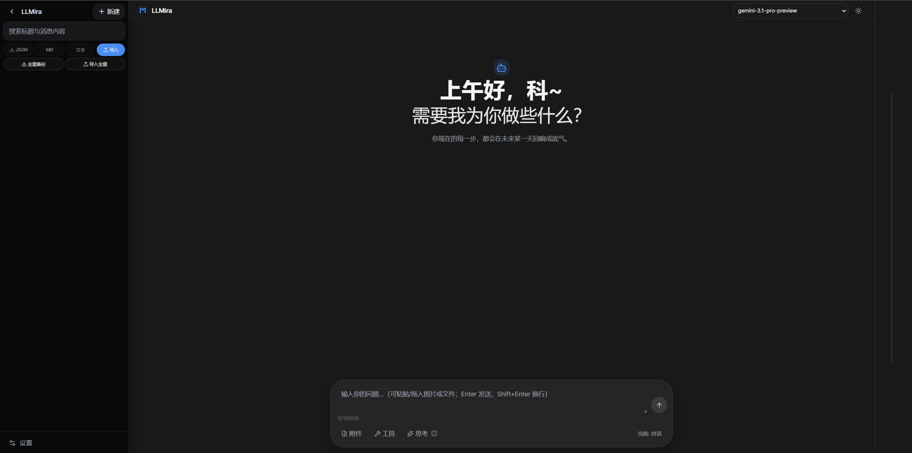
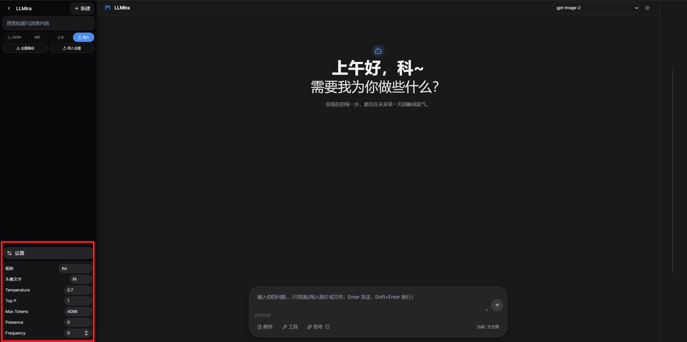

<span id="readme-zh-cn"></span>

<div align="center">


<h1>LLMira</h1>

<p>
  基于 Next.js 14 与 TypeScript 的本地优先 AI 对话应用，默认对接慧言 OpenAI 兼容接口。
  <br />
  流式对话、多模态附件、文生图、会话持久化与导出一站式完成。
</p>

<p>
  <strong><a href="#english-version">English</a></strong>
  &nbsp;·&nbsp;
  <a href="docs/README.md"><strong>文档索引</strong></a>
  &nbsp;·&nbsp;
  <a href="docs/engineering/architecture.md">架构</a>
  &nbsp;·&nbsp;
  <a href="https://doc.zhypub.cn/docs/api/">慧言 API</a>
</p>

<p>
  
  
  
</p>

</div>

---

## 什么是 LLMira

LLMira 将以下几部分组合在一起：

1. **对话界面**：左侧历史会话、右侧主对话区；桌面端可折叠侧栏，移动端抽屉式导航；深色 / 浅色主题。
2. **模型与参数**：通过 `GET /v1/models` 拉取模型列表，支持按模型保存生成参数，并可一键应用到全部模型。
3. **本地数据与工具**：Dexie.js 会话持久化、搜索 / 重命名 / 导出（JSON、Markdown、纯文本）与导入；统一结构化日志 `@/lib/logger`。

面向大模型服务的「镜像式」接入：`LLM` + `Mira`（映照与交互界面）。详见下文「命名说明」。

## 快速上手

以下命令均在**本仓库根目录**（`LLMira/`）执行。

```bash
npm install
cp .env.example .env.local
# 按需编辑 .env.local
npm run dev
```

浏览器打开 [`http://localhost:3000`](http://localhost:3000)（会重定向到 `/chat`）。首次进入可按引导配置昵称、API Key 与模型参数。

```bash
# 可选：生产构建与检查
npm run build
npm run lint
```

常用环境变量示例见下方「本地开发」表格；完整说明仍可参考 [.env.example](.env.example)。

## 你想……

| 你想…… | 可以这样做 |
| --- | --- |
| 从零跑起来 | 按上文「快速上手」执行 `npm install` → `.env.local` → `npm run dev` |
| 浏览模块文档 | [docs/README.md](docs/README.md) |
| 了解目录与边界 | [docs/engineering/architecture.md](docs/engineering/architecture.md) |
| 参与开发与提交规范 | [docs/engineering/CONTRIBUTING.md](docs/engineering/CONTRIBUTING.md) |
| 查 API 协议与示例 | [慧言 API 教程](https://doc.zhypub.cn/docs/api/) · [OpenAI 协议示例](https://s.apifox.cn/684f53a9-f231-43b0-a0dc-e3224d5ab341/api-179544799) |

Next.js 应用细节与约束见 [AGENTS.md](AGENTS.md)。

## 架构

```text
LLMira/
├── src/
│   ├── app/           # App Router：页面与 error 边界
│   ├── components/    # UI：chat、layout、markdown、modals、ui（Radix）
│   ├── hooks/        # useChat、useConversations、useModels 等
│   ├── lib/          # api、db、store、logger、chat 工具
│   └── types/        # 共享 TS 类型
├── docs/
│   ├── engineering/   # 架构、贡献指南、Python 附录等
│   └── features/     # 按模块的功能说明
├── public/           # 静态资源（含 llmira-logo.svg）
└── images/           # README 等行为截图
```

**技术栈**：Next.js 14、React 18、TypeScript、Tailwind CSS、Zustand、Dexie、pino。

## 本地开发

| 目的 | 命令 | 说明 |
| --- | --- | --- |
| 日常界面与联调 | `npm run dev` | 读取 `.env.local` |
| 生产构建验证 | `npm run build` / `npm start` | 部署前自检 |
| 代码风格 | `npm run lint` | ESLint |

环境变量可参考 `.env.example`，例如：`NEXT_PUBLIC_API_BASE_URL`、`NEXT_PUBLIC_MODEL_PRESET`、`NEXT_PUBLIC_INPUT_MAX_CHARS`、`NEXT_PUBLIC_LOG_LEVEL` / `LOG_LEVEL` 等。

## 功能特性

### 对话与交互

- 流式输出（SSE）、停止生成（Abort）；切换会话时中止当前流
- 可选「深度思考」分区展示（可折叠）
- 消息级：复制、编辑用户消息并重答、删除、最后一条助手重新生成
- 顶部 **文生图 / 对话** 模式切换

### 输入与附件

- 拖入、选择文件、粘贴图片或文件；多模态与本地 PDF/文本解析
- 解析完成前保护发送；可选 `NEXT_PUBLIC_INPUT_MAX_CHARS`
- Enter 发送 / Shift+Enter 换行

### 内容与数据

- Markdown + LaTeX (KaTeX) + 代码高亮与复制
- 文生图网格、预览、下载、重试
- 侧栏搜索、重命名、导出 / 导入
- 宽屏提问导览与 Artifacts 面板

### 其他

- 模型列表与预设合并；响应式与安全区适配
- 业务日志关键字示例：`[Request Model]`、`[Stream Start]`、`[Token Count]`

## API 文档参考

- [慧言 API 教程](https://doc.zhypub.cn/docs/api/)
- [OpenAI 协议示例](https://s.apifox.cn/684f53a9-f231-43b0-a0dc-e3224d5ab341/api-179544799)

## 日志

请使用 `@/lib/logger`（`debug` / `info` / `warn` / `error`），勿在业务代码中裸用 `console.*`。级别由 `NEXT_PUBLIC_LOG_LEVEL` 或 `LOG_LEVEL` 控制（默认 `info`）。

## Docker 部署

```bash
docker build -t llmira .
docker run --rm -p 3000:3000 --env NEXT_PUBLIC_API_BASE_URL=https://api.huiyan-ai.cn llmira
```

## 命名说明

`LLMira` 可理解为 `LLM + Mira`：**LLM** 表示围绕大模型构建；**Mira** 取「镜像 / 映照（mirror）」与命名传统中的积极意象。在本项目中指面向大模型服务的镜像式接入与交互界面。

## 文档与规范

- [CHANGELOG.md](CHANGELOG.md)
- [docs/README.md](docs/README.md)
- [docs/engineering/CONTRIBUTING.md](docs/engineering/CONTRIBUTING.md)
- [docs/engineering/python-appendix.md](docs/engineering/python-appendix.md)
- [.cursor/rules/engineering-standards.mdc](.cursor/rules/engineering-standards.mdc)

## 页面展示

### 页面整体（暗色主题）



### 页面整体（亮色主题）

.png)

### 切换文生图模式


### 设置模型参数



### 切换模型


---

<span id="english-version"></span>

<div align="center">


<h1>LLMira</h1>

<p>
  A local-first AI chat app built with Next.js 14 and TypeScript, targeting an OpenAI-compatible API (Huiyan by default).
  <br />
  Streaming chat, multimodal attachments, image generation, persistence, and exports in one place.
</p>

<p>
  <strong><a href="#readme-zh-cn">中文版</a></strong>
  &nbsp;·&nbsp;
  <a href="docs/README.md"><strong>Docs index</strong></a>
  &nbsp;·&nbsp;
  <a href="docs/engineering/architecture.md">Architecture</a>
  &nbsp;·&nbsp;
  <a href="https://doc.zhypub.cn/docs/api/">Huiyan API</a>
</p>

<p>
  
  
  
</p>

</div>

---

## What is LLMira

LLMira brings together:

1. **Chat UX**: Conversation history sidebar + main pane; collapsible sidebar on desktop and a drawer on mobile; light/dark themes.
2. **Models & parameters**: Models from `GET /v1/models`, per-model generation settings, and optional apply-to-all-models.
3. **Local persistence & tooling**: Dexie-backed sessions, search/rename/import/export (JSON, Markdown, plain text), and structured logging via `@/lib/logger`.

The name suggests **LLM** plus **Mira** (mirror / reflection): an interface that reflects your chosen model API.

## Quick start

Run these from the **repository root** (`LLMira/`).

```bash
npm install
cp .env.example .env.local
# Edit .env.local as needed
npm run dev
```

Open [`http://localhost:3000`](http://localhost:3000) (redirects to `/chat`). First launch walks you through nickname, API key, and model settings.

```bash
# Optional: production build & checks
npm run build
npm run lint
```

For environment variables, see `.env.example` and the **Develop locally** table below.

## If you want to…

| You want to… | Do this |
| --- | --- |
| Run from scratch | `npm install` → `.env.local` → `npm run dev` |
| Browse module docs | [docs/README.md](docs/README.md) |
| Understand layout & boundaries | [docs/engineering/architecture.md](docs/engineering/architecture.md) |
| Contribute (Git/logging/style) | [docs/engineering/CONTRIBUTING.md](docs/engineering/CONTRIBUTING.md) |
| Read API shapes & examples | [Huiyan API docs](https://doc.zhypub.cn/docs/api/) · [OpenAI-style example](https://s.apifox.cn/684f53a9-f231-43b0-a0dc-e3224d5ab341/api-179544799) |

App-router conventions and constraints: see [AGENTS.md](AGENTS.md).

## Architecture

```text
LLMira/
├── src/
│   ├── app/           # App Router: routes & error boundaries
│   ├── components/    # UI: chat, layout, markdown, modals, ui (Radix)
│   ├── hooks/         # useChat, useConversations, useModels, …
│   ├── lib/           # api, db, store, logger, chat helpers
│   └── types/         # Shared TS types
├── docs/
│   ├── engineering/   # Architecture, contributing, Python appendix, …
│   └── features/      # Feature-focused notes
├── public/            # Static assets (incl. llmira-logo.svg)
└── images/            # Screenshots for docs / README
```

**Stack**: Next.js 14, React 18, TypeScript, Tailwind CSS, Zustand, Dexie, pino.

## Develop locally

| Goal | Command | Notes |
| --- | --- | --- |
| Day-to-day dev | `npm run dev` | Uses `.env.local` |
| Production-like check | `npm run build` / `npm start` | Before deploy |
| Lint | `npm run lint` | ESLint |

Configure via `.env.example`: e.g. `NEXT_PUBLIC_API_BASE_URL`, `NEXT_PUBLIC_MODEL_PRESET`, `NEXT_PUBLIC_INPUT_MAX_CHARS`, `NEXT_PUBLIC_LOG_LEVEL` / `LOG_LEVEL`.

## Features

### Chat & interaction

- Streaming (SSE), stop generation (Abort); abort on conversation switch
- Optional “deep thinking” separated from the final answer (collapsible)
- Per-message actions: copy, edit user message and re-run, delete, regenerate last assistant turn
- **Chat vs image generation** mode toggle at the top

### Input & attachments

- Drag-and-drop, file picker, paste images/files; multimodal payloads
- PDF/text parsed locally before send; guarded send until parsing completes
- Optional `NEXT_PUBLIC_INPUT_MAX_CHARS`
- Enter to send, Shift+Enter for newline

### Content & data

- Markdown + LaTeX (KaTeX) + syntax-highlighted code with copy
- Image grid with preview, download, retry
- Sidebar search/rename/import/export
- Wide-screen outline navigation and Artifacts panel

### Other

- Models list merged with presets; responsive layout / safe-area aware
- Log breadcrumbs such as `[Request Model]`, `[Stream Start]`, `[Token Count]`

## API reference links

- [Huiyan API tutorial](https://doc.zhypub.cn/docs/api/)
- [OpenAI-compatible example](https://s.apifox.cn/684f53a9-f231-43b0-a0dc-e3224d5ab341/api-179544799)

## Logging

Use `@/lib/logger` (`debug` / `info` / `warn` / `error`). Avoid raw `console.*` in application code. Level via `NEXT_PUBLIC_LOG_LEVEL` or `LOG_LEVEL` (default `info`).

## Docker

```bash
docker build -t llmira .
docker run --rm -p 3000:3000 --env NEXT_PUBLIC_API_BASE_URL=https://api.huiyan-ai.cn llmira
```

## Docs & standards

- [CHANGELOG.md](CHANGELOG.md)
- [docs/README.md](docs/README.md)
- [docs/engineering/CONTRIBUTING.md](docs/engineering/CONTRIBUTING.md)
- [docs/engineering/python-appendix.md](docs/engineering/python-appendix.md)
- [.cursor/rules/engineering-standards.mdc](.cursor/rules/engineering-standards.mdc)

## Screenshots

### Dark theme


### Light theme

.png)

### Switch to image mode


### Model parameters


### Switch model


