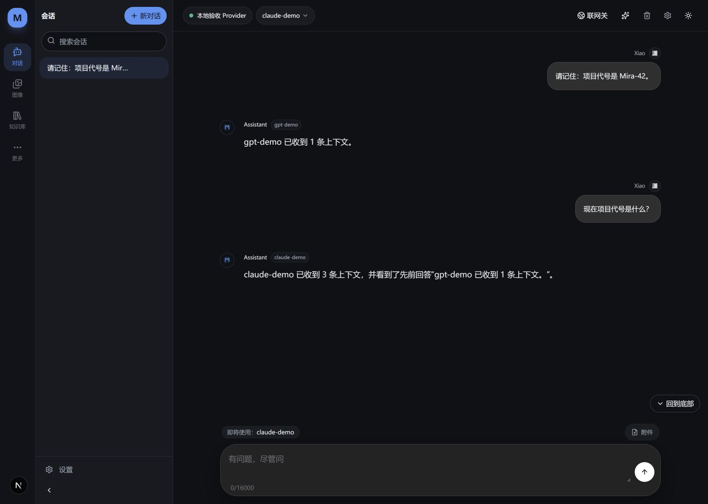
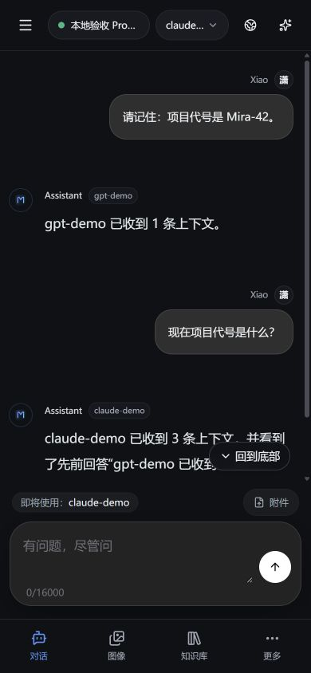
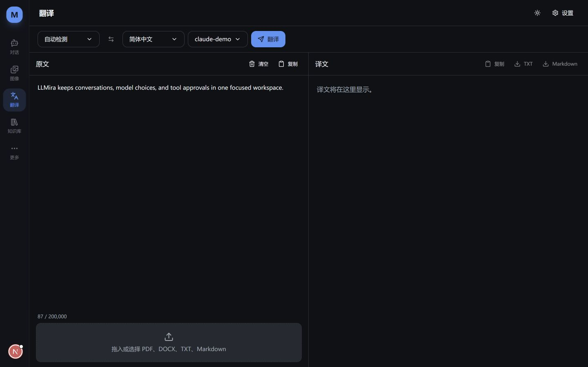
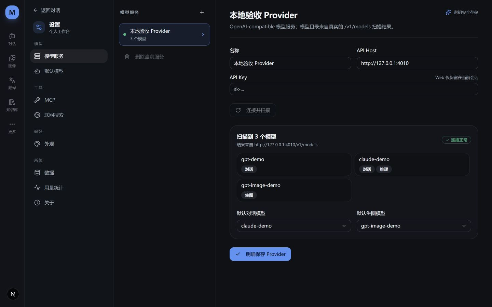
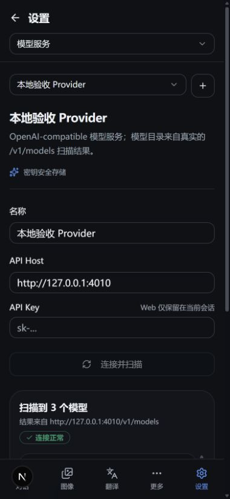
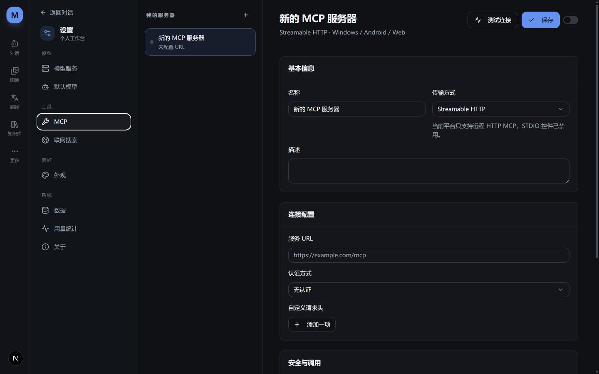

<!--
  Purpose: LLMira 产品入口、安装下载与个人使用指南
  Author: fangtoast <fangtoast@foxmail.com>
  Copyright: LLMira contributors
-->

<div align="center">
  
  <h1>LLMira</h1>
  <strong>安装即用的个人多模型 AI 客户端</strong>
  <p>Provider 模型扫描 · 连续对话 · 跨模型上下文 · 生图 · 联网引用 · 可选团队协作</p>
  <p>
    <a href="#下载与安装">下载</a> ·
    <a href="#个人使用指南">使用指南</a> ·
    <a href="#已经可以做什么">功能</a> ·
    <a href="docs/README.md">文档</a> ·
    <a href="#english-version">English</a>
  </p>
</div>

> [!IMPORTANT]
> `v0.2.0-dev.1` 是 Developer Preview。Windows 与 Android 默认在设备上直连 OpenAI-compatible Provider，不需要 Docker 或团队服务器；Web 版仍通过自托管 LLMira 网关使用。团队与 Agent 位于“更多”，不影响个人对话主流程。

## 下载与安装

前往 **[GitHub Releases](https://github.com/fangtoast/LLMira/releases)** 下载同一版本的安装包和 `SHA256SUMS.txt`。

| 平台 | 下载文件 | 怎么安装 |
| --- | --- | --- |
| Windows 10/11 x64 | `LLMira_*_x64-setup.exe`（推荐）或 `.msi` | 双击安装；未配置正式签名时 Windows 可能显示发布者提醒 |
| Android 7.0+ arm64 | `.apk` | 临时允许当前浏览器或文件管理器“安装未知应用”；`.aab` 仅供商店上传 |
| Web | 静态客户端与自托管服务 | 按[部署与恢复](docs/部署与恢复.md)启动网关后访问 |

Release 只有在 Windows `.exe/.msi`、Android `.apk/.aab` 和校验文件全部构建成功后才会创建。详细的签名与校验步骤见[开发版说明](docs/开发版说明.md)。

## 界面预览

先看实际使用，再看配置界面。以下截图来自本地演示环境，Provider、模型、会话与输入内容均为演示数据，不包含真实密钥。Windows 与 Web 共用主要界面结构，Android 针对窄屏改为底部导航和单列设置。

### 连续对话

<table>
  <tr>
    <td width="68%" align="center">
      
      <br /><sub>Windows / Web：连续对话与跨模型上下文演示；会话历史在左侧，Provider、模型和联网状态位于顶部</sub>
    </td>
    <td width="32%" align="center">
      
      <br /><sub>Android：手机端继续对话，常用能力收进单手可达的底部导航</sub>
    </td>
  </tr>
</table>

### 翻译与文档处理

<p align="center">
  
  <br /><sub>长文本翻译：选择目标语言和模型，粘贴文本或导入 PDF、DOCX、TXT、Markdown，再导出译文</sub>
</p>

### 配置与工具扩展

<table>
  <tr>
    <td width="68%" align="center">
      
      <br /><sub>Windows / Web：连接 OpenAI-compatible Provider，扫描模型目录并识别对话、推理与生图能力</sub>
    </td>
    <td width="32%" align="center">
      
      <br /><sub>Android：同一套 Provider 配置在窄屏下使用单列布局，底部导航始终可达</sub>
    </td>
  </tr>
</table>

<p align="center">
  
  <br /><sub>MCP：配置远程 HTTP 工具服务、认证、超时与逐次人工批准；秘密值不会进入 localStorage、日志或备份</sub>
</p>

## 什么是 LLMira

LLMira 先解决一个人的日常 AI 使用：把自己的 API Host 和 API Key 加进来，真实扫描网关提供的 GPT、Claude、DeepSeek 等模型，然后开始流式对话、生图或联网查询。需要共享知识、密钥和审计时，再进入可选的团队工作台。

### 名字的由来

`LLMira` 可以理解为 `LLM + Mira`：

- **LLM** 是 Large Language Model，代表项目围绕大语言模型构建；
- **Mira** 取“镜像、映照（mirror）”的联想，也借用拉丁语词根 *mirus* 所带来的“令人惊叹、美好”意象，以及米拉星的象征意义；
- 合在一起，LLMira 是一面连接不同模型、知识与工具的“智能之镜”：同一个界面映照你的问题，并让不同 AI 能力协同完成工作。

这里的 `Mira` 是产品命名意象，并非对古希腊语词源的严格主张。

## 个人使用指南

1. 安装并打开 LLMira，首屏就是“新对话”。
2. 填写 Provider 名称、API Host 和 API Key，点击“连接并扫描”。LLMira 会真实请求规范化后的 `/v1/models`。
3. 核对扫描结果，选择默认对话模型和可选生图模型，再点击“明确保存 Provider”。
4. 在“对话”发送第一条消息。会话此时才保存到设备；在顶部切换模型只影响下一轮，新的模型仍会收到此前有效上下文。
5. 进入“图像”调用同一 Provider 的 `/v1/images/generations`。没有生图模型时，回到设置修正模型能力或更换 Provider。
6. 对话顶部可选择“联网关闭 / 自动 / 开启”。模型原生搜索优先；否则按设置回退到 SearXNG、Tavily 或 Brave，并显示可点击引用卡片。
7. 只有需要成员邀请、共享工作区或团队密钥时，才进入“更多 → 团队协作”。

正常对话上下文不使用 RAG。历史达到模型窗口约 70% 后，LLMira 会摘要较早轮次并保留最近 12 轮；RAG 只属于独立知识库功能。

## 已经可以做什么

| 能力 | 当前实现 |
| --- | --- |
| 多 Provider | 添加多个 OpenAI-compatible Provider；以 `{providerId, modelId}` 区分同名模型 |
| 模型扫描 | 请求 `/v1/models`，兼容标准 `data[].id` 与常见网关数组；显示 401/403、超时、无模型和无效 JSON 等具体错误 |
| 连续对话 | 流式回答、停止、编辑重答、重新生成、附件、Markdown/LaTeX、代码高亮和本地历史 |
| 跨模型上下文 | 第一轮使用 GPT、下一轮切换 Claude 时，Claude 会收到同一会话的有效历史；旧回答保留实际 Provider/模型标签 |
| 图像生成 | 独立“图像”入口，支持兼容的尺寸/质量参数、重新生成、预览与下载 |
| 联网查询 | 原生搜索优先；SearXNG/Tavily/Brave 回退；最多 5 条结果、抓取前 3 条并持久化引用 |
| 个人 MCP | Windows 支持 Streamable HTTP 与 STDIO，Android/Web 支持远程 HTTP；工具逐次审批、超时与取消均进入聊天工具循环 |
| 用量与计费 | 从启用后的新调用开始，在本机记录聊天、翻译、生图、搜索与 MCP；提供年度热力图、筛选明细、价格覆盖和 CSV/JSON 导出 |
| 设备安全 | Tauri HTTP 直连；Key 进入系统凭据库（Windows Credential Manager / Android Keystore），不写 localStorage；Web 刷新后需重新输入 Key |
| Web 网关 | Fastify 提供 Provider 临时检查、目录刷新、聚合模型和 OpenAI-compatible 网关；服务端密钥加密保存 |

### 正在继续完成

- 个人知识库已拥有独立入口，文档摄取、混合检索与定位引用仍在后续阶段；
- Agent、模型对比和团队用量保留为扩展/实验能力；个人 MCP 与本地用量账本已进入设置中心；
- iOS、完整离线知识库、正式商店签名和 Windows Authenticode 不包含在本预览版内。

## 参考项目与 LLMira 的取舍

LLMira 不复制参考项目的代码、素材或界面，只学习其公开产品思路。

| 参考方向 | LLMira 对应能力 | 本版取舍 |
| --- | --- | --- |
| [Cherry Studio](https://github.com/CherryHQ/cherry-studio) 的多供应商、模型能力与 MCP | 多 Provider、能力标记、模型/Provider 联合选择与个人 MCP | 只借鉴公开架构和行为，不复制 AGPL 实现；不包含市场、自动安装和 OAuth |
| [Chatbox](https://github.com/chatboxai/chatbox) 的轻量对话与跨端体验 | 新对话首屏、会话历史、流式输出、附件与独立设置 | 默认界面不展示团队卡片、知识树或 Agent 授权 |
| [AnythingLLM](https://github.com/Mintplex-Labs/anything-llm) 的知识与多用户工作区 | 独立知识库入口、可选团队服务器和工作区隔离 | 普通上下文不滥用 RAG；邀请只属于团队功能 |

## 从源码运行

| 环境 | 要求 |
| --- | --- |
| 客户端 | Node.js 24.x、npm 11.6.x |
| Windows 外壳 | Rust stable、MSVC、WebView2、WiX/NSIS |
| Android 外壳 | JDK 17、Android SDK Platform 36、Build Tools 36.0.0、NDK r27c、Platform Tools、Rust `aarch64-linux-android` target |
| 可选团队服务 | PostgreSQL + pgvector、Redis、MinIO、Caddy |

```powershell
npm install
npm run dev
```

桌面/手机个人模式不要求 `.env.local`。Web 自托管和团队服务可参考 `.env.example` 后运行：

```powershell
Copy-Item .env.example .env.local
docker compose up -d
```

### 开发与检查

| 场景 | 命令 |
| --- | --- |
| 前端开发 | `npm run dev` |
| 完整门禁 | `npm run check` |
| API / Worker | `npm run dev --workspace @llmira/api` / `npm run dev --workspace @llmira/worker` |
| Rust 检查 | `cargo check --manifest-path src-tauri/Cargo.toml` |
| Windows 包 | `npm run tauri:build:windows` |
| Android 包 | `npm run tauri:android:init` / `npm run tauri:build:android` |

### Android 构建与 HTTP MCP 真机验收

Windows 首次构建前请安装上表工具，并启用 Windows“开发者模式”；Tauri 的 Android Gradle 任务需要创建原生库符号链接，未启用时会提示 `Creation symbolic link is not allowed`。随后执行：

```powershell
rustup target add aarch64-linux-android
npm run tauri:android:init -- --ci --skip-targets-install
npx tauri android build --debug --apk --target aarch64 --ci
```

Android 仅支持 Streamable HTTP MCP，不提供本地 STDIO。仓库内置了不记录工具参数和结果的验收服务；连接实体设备并允许 USB 调试后，可以验证工具发现和调用：

```powershell
npm run dev:test-mcp-http
adb devices -l
adb reverse tcp:4120 tcp:4120
adb install -r src-tauri/gen/android/app/build/outputs/apk/arm64/debug/app-arm64-debug.apk
```

在应用的“设置 → MCP”中新增 HTTP 服务 `http://127.0.0.1:4120/mcp`，测试连接应发现 `echo` 工具。若要验收完整聊天工具循环，可再运行 `npm run dev:mock-provider`、执行 `adb reverse tcp:4010 tcp:4010`，并将 Provider 地址设为 `http://127.0.0.1:4010`；发送消息、批准工具卡后，应看到 MCP 结果进入模型续跑。验收至少确认：设备不是模拟器、工具可发现、调用可批准、结果可续跑、停止生成可取消调用。

上述 `127.0.0.1` 与明文 HTTP 只用于 USB 反向端口映射下的调试 APK。正式 Android 包应连接启用 HTTPS 的远程 MCP 服务；密钥仍只进入 Android Keystore，不写入 `localStorage`、日志或备份。

## 仓库结构

```text
LLMira/
├── src/                    # Next.js 16.3 静态个人客户端
├── apps/api/               # Web/团队 Fastify API 与 OpenAI-compatible 网关
├── apps/worker/            # 知识摄取与扩展任务 Worker
├── packages/contracts/     # 跨端共享领域类型
├── packages/provider-core/ # OpenAI-compatible 扫描、能力与错误分类
├── packages/security/      # 服务端密钥加密与令牌摘要
├── infra/                  # Caddy、Compose 与 PostgreSQL 迁移
├── src-tauri/              # Windows / Android 外壳、系统凭据库、桌面旧凭据迁移与 SQLite
└── .github/workflows/      # 质量门禁与完整 Release 构建
```

## 文档与发布

- [文档索引](docs/README.md)
- [开发版安装说明](docs/开发版说明.md)
- [发布与打包](docs/发布与打包.md)
- [工程架构](docs/engineering/architecture.md)
- [API 与安全边界](docs/API与安全边界.md)
- [部署与恢复](docs/部署与恢复.md)

不要提交 `.env.local`、真实 API Key、Cookie、Stronghold 文件、SQLite 数据库、签名证书或 keystore。`reference/` 仅供本地研究，已从版本控制与检查中排除。

---

<span id="english-version"></span>

## English

LLMira is a personal-first, cross-platform AI client. Add an OpenAI-compatible API host and key, scan the real `/v1/models` catalog, then chat across GPT, Claude, DeepSeek, and other models returned by that provider. Switching models affects the next turn while preserving the same conversation context.

Windows and Android connect directly from the device and keep secrets in the OS credential vault (Windows Credential Manager / Android Keystore). Web secrets stay in memory and must be entered again after a refresh. The Web build uses a self-hosted LLMira gateway. Image generation and read-only web search with citations are available in the personal flow; team collaboration and Agent experiments are optional extensions under “More”.

Download `v0.2.0-dev.1` from [GitHub Releases](https://github.com/fangtoast/LLMira/releases), or run the client locally:

```powershell
npm install
npm run dev
```

See the [documentation index](docs/README.md), [Developer Preview guide](docs/开发版说明.md), and [release guide](docs/发布与打包.md).
