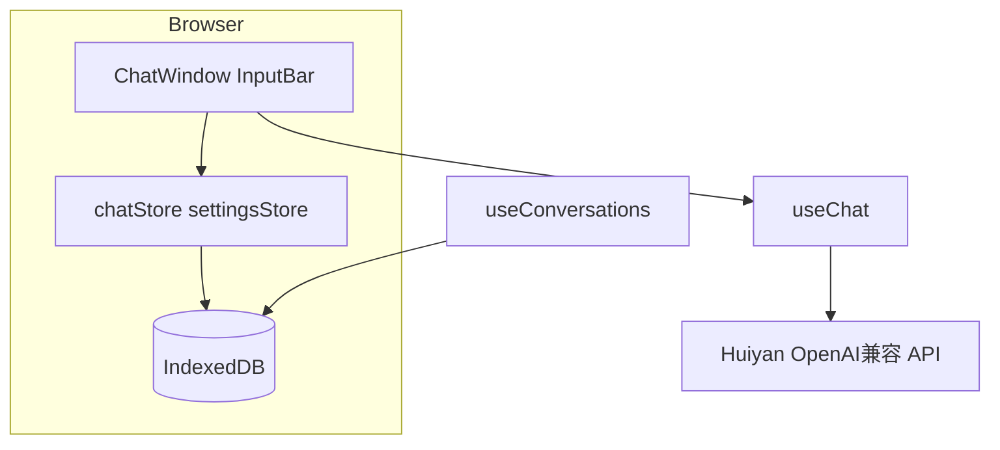

# LLMira 架构总览

## 技术栈

- **框架**：Next.js 14（App Router）、React 18、TypeScript
- **状态**：Zustand（`src/lib/store/*`）
- **本地持久化**：Dexie / IndexedDB（`src/lib/db/dexie.ts`）
- **样式**：Tailwind CSS、部分 Radix UI（`src/components/ui`）

## 目录职责

| 路径 | 职责 |
|------|------|
| `src/app` | 路由与根布局；`/chat` 为对话主入口 |
| `src/components/chat` | 消息列表、输入条、流式展示、导览等 |
| `src/components/layout` | 顶栏、侧栏、主布局装配 |
| `src/components/markdown` | Markdown / 代码块渲染 |
| `src/hooks` | `useChat`、`useConversations`、`useModels` 等 |
| `src/lib/api` | OpenAI 兼容 HTTP 与 SSE 流式解析 |
| `src/lib/chat` | 请求消息组装、导入导出 |
| `src/lib/db` | Dexie 表与版本 |
| `src/lib/store` | 会话与设置的全局状态 |
| `src/types` | 共享 TypeScript 类型 |

## 数据流（简图）

1. 用户通过 `useChat().sendMessage` 发送；消息写入 `chatStore`，并触发 `useConversations.saveMessages` 持久化。
2. 流式回复由 `lib/api/client.ts` 的 `streamChatCompletion` 解析 SSE，逐 token 更新 store 中最后一条 assistant 消息。
3. 刷新页面后 `useConversations.loadMessages` 从 Dexie 按时间排序读回（含稳定次序键），再写入 `chatStore`。

## 与外部系统边界

- **仅浏览器端**直连配置中的 `NEXT_PUBLIC_API_BASE_URL`；API Key 存于 `settingsStore`（localStorage 持久化，实现见 `settingsStore`）。
- 日志经 `@/lib/logger` 输出，避免业务代码裸 `console`。

## 相关文档

- [持久化与 Dexie](features/persistence-dexie.md)
- [流式对话与 API 客户端](features/api-client.md)
- [工程贡献说明](CONTRIBUTING.md)
