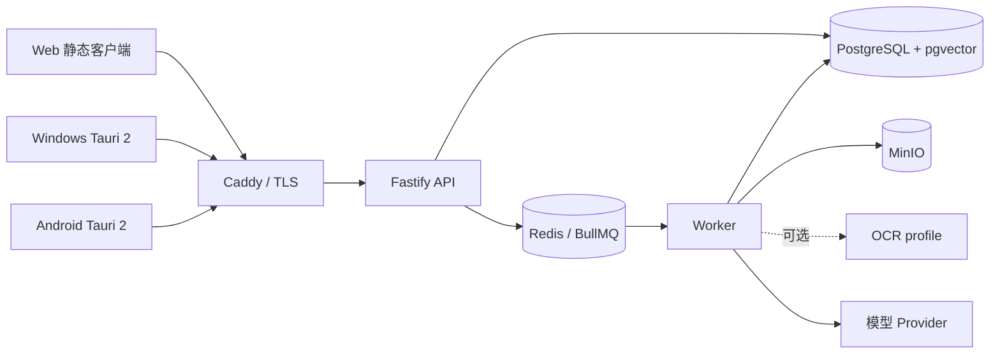
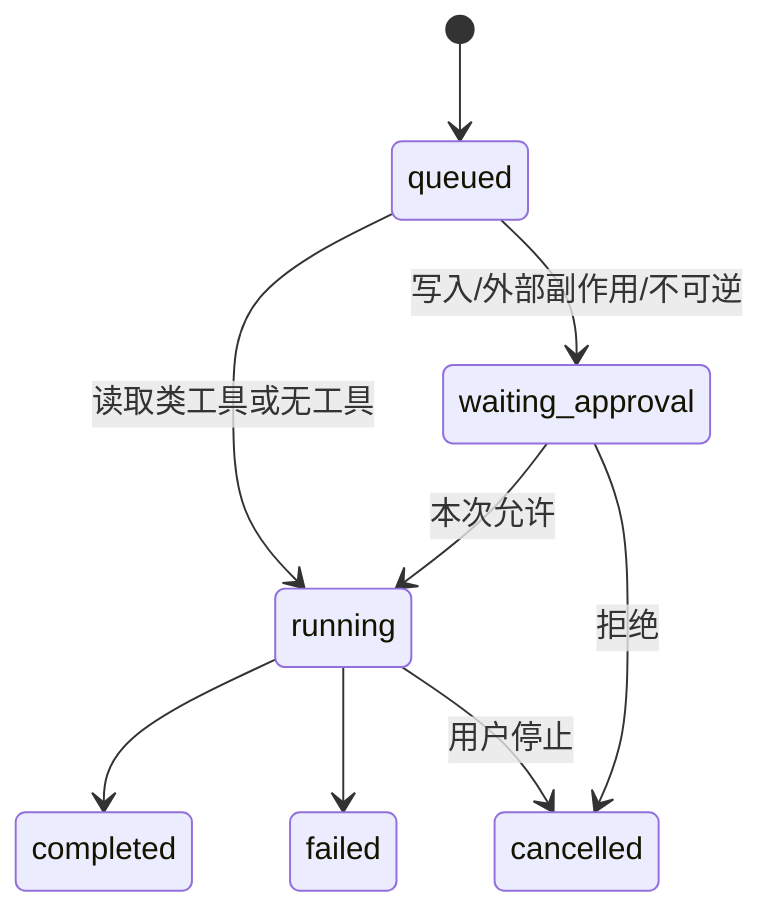

<!--
  Purpose: LLMira 团队版系统架构与边界
  Author: fangtoast <fangtoast@foxmail.com>
-->

# 工程架构

本文面向维护者，描述 LLMira 团队版的运行边界、数据流和目录职责。部署参数见[部署与恢复](../部署与恢复.md)，外部接口和安全策略见[API 与安全边界](../API与安全边界.md)。

## 运行拓扑

```mermaid
flowchart LR
  Web[Web 静态客户端] --> Caddy[Caddy / TLS]
  Win[Windows Tauri 2] --> Caddy
  Android[Android Tauri 2] --> Caddy
  Caddy --> API[Fastify API]
  API --> PG[(PostgreSQL + pgvector)]
  API --> Redis[(Redis / BullMQ)]
  Redis --> Worker[Worker]
  Worker --> PG
  Worker --> MinIO[(MinIO)]
  Worker -. 可选 .-> OCR[OCR profile]
  Worker --> Provider[模型 Provider]
```

Next.js 使用 `output: "export"`。浏览器和 WebView 只加载 `out/`，认证、知识检索、Agent、定时任务和 OpenAI 兼容网关全部进入独立 API。

## npm workspaces

| 路径 | 职责 |
| --- | --- |
| `src/` | 响应式客户端、登录入口、工作台和迁移兼容模块 |
| `apps/api/` | Fastify、Argon2id、Cookie/Bearer、RLS 用户上下文、SSE、审计 |
| `apps/worker/` | BullMQ、文档解析、安全抓取、嵌入、Agent 调用 |
| `packages/contracts/` | `AgentRunStatus`、`ToolRisk`、事件、引用、Provider 与角色 |
| `packages/security/` | AES-256-GCM 信封、令牌摘要与脱敏 |
| `src-tauri/` | Windows/Android 外壳、系统凭据库、Stronghold、SQLite 草稿和 outbox |
| `infra/` | Caddy 与 PostgreSQL 初始化迁移 |

## 数据隔离

固定角色为 `org_admin`、`workspace_owner`、`editor`、`viewer`。业务表启用并强制 RLS；API 在事务内切换到 `llmira_app`，同时设置 `app.current_user_id`。路由仍先执行显式角色检查，RLS 作为数据库级第二道边界。

高频列表使用 `(workspace_id, updated_at, id)` 或同类复合索引和游标分页。UUID 使用 v7；外键均配套索引。Worker 通过受控队列 ID 读取数据，不在任务载荷中传正文或密钥。

## Agent 状态机

```mermaid
stateDiagram-v2
  [*] --> queued
  queued --> running: 读取类工具或无工具
  queued --> waiting_approval: 写入/外部副作用/不可逆
  waiting_approval --> running: 本次允许
  waiting_approval --> cancelled: 拒绝
  running --> completed
  running --> failed
  running --> cancelled: 用户停止
```

运行事件写入 `run_events` 并由 `/api/v1/runs/{id}/events` 按 sequence 输出。客户端携带 `Last-Event-ID` 后可以续传。写操作结果不明确时不自动重试；安全重放必须带幂等键。

## 知识摄取

`knowledge-ingest` 队列按文档 ID 工作：

1. 从 MinIO 读取上传对象，或对网页 URL 每次重定向重新执行 SSRF 校验；
2. 按 MIME 类型延迟加载 PDF/DOCX 解析器；
3. 清洗和分块后写入 `knowledge_chunks`；
4. 配置团队嵌入时批量生成向量，同时保留 PostgreSQL 全文索引；
5. 引用保存文档、分块、页码/章节和原文片段。

扫描件 OCR 是 Docker Compose 的可选 `ocr` profile，不是默认依赖。当前 Compose 已建立隔离服务边界；正式启用前仍需为选定的 OCR 服务实现 Worker 提交适配器并完成恶意扫描件验收。

## 客户端边界

- Web：HttpOnly 安全 Cookie，不把令牌或 Provider Key 写入 localStorage。
- Tauri：Provider、搜索与 MCP 设备密钥进入系统凭据库；团队刷新令牌仍进入 Stronghold。
- SQLite：只保存近期消息、离线草稿和幂等 outbox，不复制完整知识库。
- 旧 Dexie：只作为迁移输入；导入验证完成后才允许用户清理本地副本。

## 性能策略

PDF、DOCX、语法高亮和 Tauri 插件均按需加载。`scripts/check-bundle-budget.mjs` 对首页初始脚本执行 215 kB gzip 门禁。服务端查询避免 offset 深分页，模型耗时不计入 API 自身 p95。
